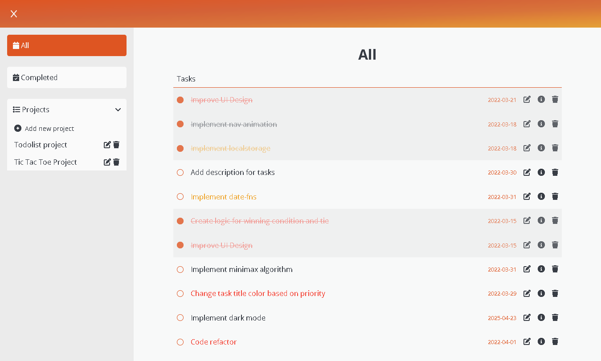

# todo-list

Todo-list project for The Odin Project. Made with HTML, CSS, and Javascript.

## Demo

[Live Preview](https://nevz9.github.io/todo-list/)

## Screenshots



## Optimizations

- Completely new code from the old one
- Separated most functions to only do one thing
- Added eslint, prettier, editorconfig to find errors and stay consistent with code style

## Lessons Learned

This was a really tough challenge. The thing that I struggled the most is removing items from the array. Which had such a simple fix.

```js
const arr = [1, 2, 3, 4];

for (let i = 0; i < arr.length; i++) {
  arr.splice(i, 1);
}
```

This doesn't work since the array gets reindexed each splice.

When **i** is equal to **0** and we spliced index **0**. The array becomes [2,3,4]

What happens is our **i** is now equal to **1** and in the new array [2,3,4] the index of **1** equals to the 2nd element of the array which is **3**
Which means that we skipped **2** therefore the array becomes [2,4] since we spliced **3**

A simple fix was to just begin the loop at the end of the array like so:

```js
const arr = [1, 2, 3, 4];

for (let i = arr.length; i > 0; i--) {
  arr.splice(i, 1);
}
```

I kind of knew this already, but it completely slipped my mind

## Acknowledgements

- [Design Inspiration](https://mooniidev.github.io/todo-list/)
- [The Odin Project](https://www.theodinproject.com/)
- [achoito](https://github.com/greqov) For finding out some issues in the app
